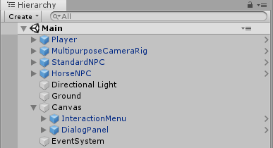
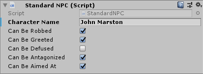

# Red Dead Dialog

This project is a demo of how to build Red Dead Remption 2's contextual dialog system using Unity.

This project was created on Unity 2019.1.0f2 but it should work with other versions.

  

### How To Use
The project comes with a scene with everything set and ready to go.

To setup a new scene, just add the **InteractionMenu** and **DialogPanel** prefabs to a canvas.

You will also need to add some NPCs to your game. This project comes with two sample NPCs in the prefabs folder: **StandardNPC** and **HorseNPC**. Observe that there are different parameters for them. The **StandardNPC**, for example, have some booleans to set if they can be robbed, greated, aimed at and etc.

To create new NPC types, create a new **C# Script / MonoBehaviour** and implement the IInteractable interface. You will need to implement three methods for this interface:

- GetName(): will return the name that is displayed when you are near the NPC
- GetTransform(): should return the transform that is being controlled by the script (usually the transform to which the script is attached). This transform will receive a message when an interaction is triggered.
- GetInteractions(): should return a list of interactions for this NPC. Implementing this method you can control which interactions are enable at each time (for example *Greet* normally and *Defuse* when the character is angry). Here you will also set the label and which button is used for each interaction, and the message that is triggered when the user presses that button.
